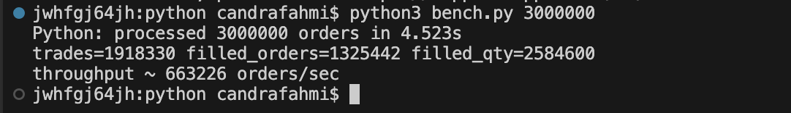
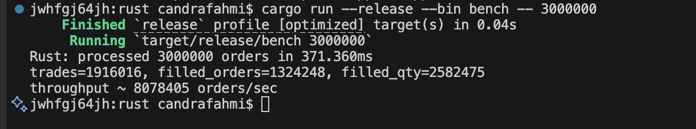
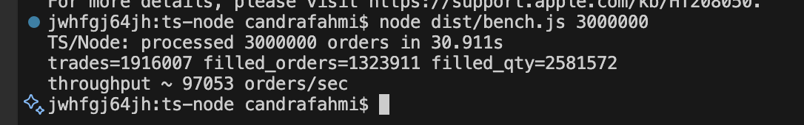

# Crypto Matching Engine – Multi-Language (Rust, Go, Python, TypeScript)

A simple matching engine for **limit** and **market** orders (BUY/SELL, FIFO per price level).
Focused on a *single-symbol* (e.g., BTC/USDT). Suitable for performance testing (e.g., generator of 3 million orders).

> Note: This implementation is **not production-ready**. No persistence, risk checks, or multi-symbol sharding.
> Single-threaded matching (most exchanges are also single-thread per symbol for fair FIFO),
> dwith optional *producer-consumer* via channels (mainly in Go).

## Key Features
- Order type: `Limit`, `Market`
- Side: `Buy`, `Sell`
- Matching: price-time priority (FIFO), partial fills, auto-removal of empty price levels
- Summary statistics: matched count, volume, rough latency
- Load harness (optional): generate N orders (e.g., 3,000,000) arriving nearly simultaneously

## Structure
- `rust/` – high-performance implementation using `BTreeMap`+ `VecDeque`
- `go/` – high-performance implementation using slices + producer-consumer channels
- `python/` – reference implementation (simpler)
- `ts-node/` – Node.js/TypeScript reference implementation

## Quick Benchmark Example (3 Million Orders)
### Rust
```bash
cd rust
cargo run --release --bin bench -- 3000000
```
### Go
```bash
cd go
go run ./cmd/bench 3000000
# atau build
go build -o bench ./cmd/bench && ./bench 3000000
```
### Python (lebih lambat, untuk validasi)
```bash
cd python
python3 bench.py 3000000
```
### TypeScript / Node
```bash
cd ts-node
npm i
npm run build
node dist/bench.js 3000000
```

## Parameters & Behavior
- Default symbol: `BTC/USDT` (label only)
- Distribution:
  - Side: 50/50 BUY/SELL
  - Order type: 90% Limit, 10% Market (adjust via args/hardcode)
  - Base price: 100,000 (±5% random)
  - Size: 1–3 (random)
- Market orders *sweep* the opposite book until fully filled or book exhausted.
- Limit orders are placed in the book if not fully filled.

## Design Notes
- **Single-thread matching** per symbol for deterministic FIFO.
- **Go** uses *channels* to queue orders (simulating “nearly simultaneous” arrival).
- **Rust** Rust uses `BTreeMap` (asks ascending, bids descending) + `VecDeque` for FIFO.
- **Python/TS**: simpler, easier to read and verify.


## Benchmark Results

Test results with **3,000,000** orders arriving almost simultaneously:

| Language      | Time           | Trades   | Filled Orders | Filled Qty | Throughput             |
|---------------|---------------:|---------:|--------------:|-----------:|------------------------|
| **Rust**      | 371.360 ms     | 1,916,016 | 1,324,248     | 2,582,475  | ~ 8,078,405 orders/sec |
| **Python**    | 4.523 s        | 1,918,330 | 1,325,442     | 2,584,600  | ~   663,226 orders/sec |
| **Go**        | 12.210 s       | 1,915,764 | 1,322,443     | 2,581,082  | ~   245,693 orders/sec |
| **TS/Node**   | 30.911 s       | 1,916,007 | 1,323,911     | 2,581,572  | ~    97,053 orders/sec |

---

## Environment

- **Machine**: MacBook Pro M3 Pro  
- **RAM**: 18 GB  
- **OS**: macOS (Apple Silicon)  
- **Rust**: 1.89.0 (29483883e 2025-08-04)
- **Go**: go1.25.0 darwin/arm64 
- **Python**: 3.12 
- **Node.js**: v20.15.1

## Notes

- **Rust** is much faster due to native compilation with aggressive optimizations. 
- **Python** is still fast enough for prototyping thanks to deque & dict, but much slower than Rust. 
- **Go** shows stable performance but is slower than Rust due to data structures & GC. 
- **Node.js** is the slowest in this case (single-threaded event loop + JS overhead).

---

## Benchmark Chart






