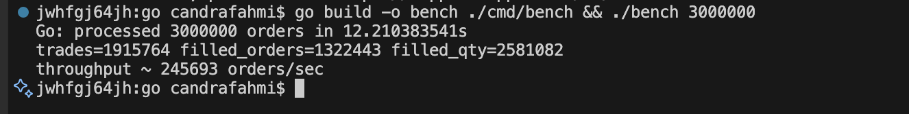

# Crypto Matching Engine – Multi Bahasa (Rust, Go, Python, TypeScript)

Mesin matching sederhana untuk orderbook **limit** dan **market** (BUY/SELL, FIFO per price level).
Fokus untuk *single-symbol* (mis. BTC/USDT). Cocok untuk uji performa (contoh generator 3 juta order).

> Catatan: Implementasi ini **bukan** produksi. Tidak ada persistence, risk checks, atau multi-symbol sharding.
> Desain single-threaded di bagian matching (umumnya bursa juga single-thread per symbol untuk keadilan FIFO),
> dengan opsi *producer-consumer* via channel (terutama di Go).

## Fitur Utama
- Order type: `Limit`, `Market`
- Side: `Buy`, `Sell`
- Matching: price-time priority (FIFO), partial fill, auto-removal level kosong
- Statistik ringkas: jumlah matched, volume, latency kasar
- Harness beban (opsional): generator N order (mis. 3,000,000) yang masuk hampir bersamaan

## Struktur
- `rust/` – implementasi cepat dengan `BTreeMap` + `VecDeque`
- `go/` – implementasi cepat dengan slice + channel producer-consumer
- `python/` – implementasi referensi (lebih sederhana)
- `ts-node/` – implementasi referensi Node.js/TypeScript

## Cara Cepat Benchmark (contoh 3 juta order)
### Rust
```bash
cd rust
cargo run --release --bin bench -- 3000000
```
### Go
```bash
cd go
go run ./cmd/bench 3000000
# atau build
go build -o bench ./cmd/bench && ./bench 3000000
```
### Python (lebih lambat, untuk validasi)
```bash
cd python
python3 bench.py 3000000
```
### TypeScript / Node
```bash
cd ts-node
npm i
npm run build
node dist/bench.js 3000000
```

## Parameter & Perilaku
- Default symbol: `BTC/USDT` (hanya label)
- Distribusi:
  - Sisi: 50/50 BUY/SELL
  - Tipe order: 90% Limit, 10% Market (ubah di argumen/hardcode)
  - Harga acuan: 100_000 (bisa acak ±5%)
  - Size: 1 s/d 3 (random)
- Market order *menyapu* book lawan hingga terpenuhi atau book habis.
- Limit order ditempatkan di book bila tidak terisi penuh.

## Catatan Desain
- **Single-thread matching** per simbol untuk deterministic FIFO.
- **Go** menggunakan *channel* untuk mengantri order (mensimulasikan “hampir barengan”).
- **Rust** memakai `BTreeMap` (asks menaik, bids menurun) + `VecDeque` untuk FIFO.
- **Python/TS**: lebih sederhana untuk dibaca dan dicek.


## Benchmark Results

Hasil uji coba dengan **3.000.000 order** masuk hampir bersamaan:

| Language      | Time           | Trades   | Filled Orders | Filled Qty | Throughput             |
|---------------|---------------:|---------:|--------------:|-----------:|------------------------|
| **Rust**      | 371.360 ms     | 1,916,016 | 1,324,248     | 2,582,475  | ~ 8,078,405 orders/sec |
| **Python**    | 4.523 s        | 1,918,330 | 1,325,442     | 2,584,600  | ~   663,226 orders/sec |
| **Go**        | 12.210 s       | 1,915,764 | 1,322,443     | 2,581,082  | ~   245,693 orders/sec |
| **TS/Node**   | 30.911 s       | 1,916,007 | 1,323,911     | 2,581,572  | ~    97,053 orders/sec |

---

## Environment

- **Machine**: MacBook Pro M3 Pro  
- **RAM**: 18 GB  
- **OS**: macOS (Apple Silicon)  
- **Rust**: 1.89.0 (29483883e 2025-08-04)
- **Go**: go1.25.0 darwin/arm64 
- **Python**: 3.12 
- **Node.js**: v20.15.1

## Notes

- Rust jauh lebih cepat karena compile ke native code dengan optimisasi agresif.  
- Python masih cukup cepat untuk prototyping berkat deque & dict, tapi kalah jauh dengan Rust.  
- Go performa stabil, tapi kalah dengan Rust karena struktur data & GC.  
- Node.js paling lambat untuk kasus ini (single-thread event loop + JS overhead).  

---

## Benchmark Chart




